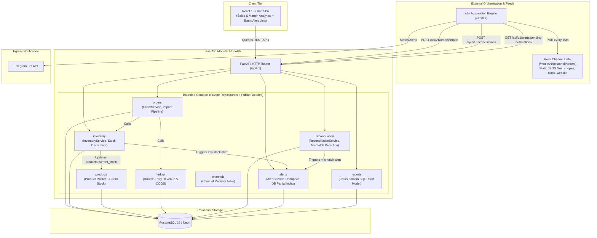
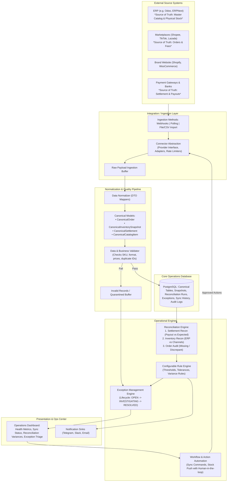
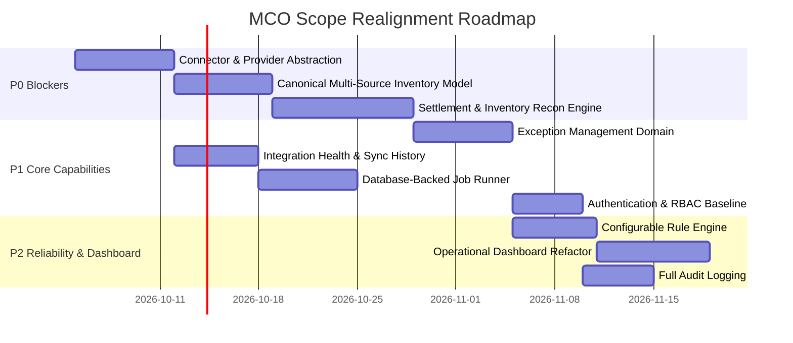

# MCO Scope Alignment Audit

**Audit Date:** 2026-10-02  
**Auditor:** Senior Software Architect, Backend Engineer & Internal Systems Reviewer  
**Platform:** Multichannel Commerce Operations (MCO)  
**Subtitle:** Multichannel Commerce Integration, Reconciliation & Automation Platform  
**Primary Focus:** Evaluating alignment of current codebase against target product positioning: **Internal Business Operations & Automation Platform** (Not an ERP).

---

## 1. Executive Summary

- **Current Architecture:**  
  A **Hardened Modular Monolith** in FastAPI + PostgreSQL, orchestrated via external n8n workflows, consumed by a React 19/Vite dashboard. The system was designed around a strict ACID order import transaction pipeline (`orders` -> `products` stock decrement -> `ledger` double-entry revenue/COGS -> `alerts`). It contains strong engineering foundations (AST boundary enforcement, strict schema contracts, partial database indexing, Docker orchestration), but **acts as a mini-ERP / Central Order Processing System** rather than an operational integration and reconciliation hub.

- **Target Architecture:**  
  A non-invasive **Internal Business Operations & Automation Platform** that connects to external source-of-truth systems (ERP, WMS, CRM, Marketplaces, Payment Gateways), normalizes heterogeneous feeds via an extensible Connector Layer into Canonical Data Models, runs multi-dimensional Reconciliation Engines (Settlement & Inventory), applies a configurable Rule Engine, drives an Exception Lifecycle (`OPEN` -> `INVESTIGATING` -> `RESOLVED`), and powers an Operational Health Dashboard for decision support and supervised automation.

- **Overall Alignment:**  
  **35% - 40% Alignment.**  
  While the technical plumbing (FastAPI framework, PostgreSQL database, Pydantic DTOs, AST boundary linter, and UI layout) is clean and high quality, **the core operational domain models are fundamentally misdirected or unbuilt**:
  1. MCO currently treats its own database as the source of truth for physical stock (`products.current_stock`), performing direct stock decrements instead of ingesting and reconciling stock snapshots from ERP and channels.
  2. Ingestion lacks an abstraction/connector layer; mock feeds in n8n are pre-normalized into MCO's internal schema.
  3. Reconciliation is restricted to order total and internal ledger consistency; it completely lacks settlement/payout reconciliation (order - fees - refunds vs. actual payout) and inventory discrepancy reconciliation.
  4. Exception Management is absent (only boolean-resolved alerts exist, without lifecycle, assignment, or root-cause tracking).
  5. The dashboard is primarily an e-commerce sales and margin analytics view rather than an operational triage and health center.

---

## 2. Current System Architecture

The existing system operates as a unified backend service with peripheral schedule triggers:



### Architectural Realities of the Current Implementation

1. **Monolithic Ingestion Transaction:** In `OrderService.import_order`, order insertion, product stock decrement (`UPDATE products SET current_stock = current_stock - quantity`), double-entry ledger creation, and low-stock alerts are tightly bundled inside a single synchronous ACID transaction.
2. **ERP Emulation:** Physical inventory balance is stored directly in `products.current_stock`. MCO acts as the WMS/ERP stock keeper.
3. **No Internal Asynchronous Job Engine:** FastAPI has no queue, worker, or scheduler (no Celery, arq, rq, or DB-backed job table). All asynchronous workflows depend entirely on external HTTP polling from n8n.
4. **Zero Authentication/Authorization:** The backend has no authentication middleware, no RBAC guards, and no user accounts. All endpoints are open.

---

## 3. Target System Architecture

The target architecture repositions MCO as an **observability, reconciliation, and operations hub**:



---

## 4. Capability Matrix

| Capability | Status | Evidence in Code | Architectural Gap & Analysis | Priority |
| :--- | :--- | :--- | :--- | :--- |
| **Connector Abstraction** | `NOT_IMPLEMENTED` | `backend/app/modules/channels/` only defines a database table `channels` (`id, code, name, platform_type`). No base class or interfaces. | Core has no `Provider`, `Connector`, or `Adapter` interfaces. Business logic cannot interact with external channels generically. | `P0` |
| **Canonical Data Model** | `PARTIALLY_IMPLEMENTED` | `backend/app/modules/orders/schemas.py:16` (`OrderImportRequest`). | There is a single ingestion DTO, but no external-to-canonical mappers exist. External sources must match MCO's schema directly. No canonical settlement or multi-source inventory models. | `P0` |
| **Source of Truth Definition** | `IMPLEMENTED_BUT_WRONG_DIRECTION` | `backend/app/modules/inventory/repository.py:14-16` ("Note: In MCO V1, physical stock is persisted on products.current_stock"). | High Architectural Risk: MCO acts as the inventory authority / WMS by mutating internal stock instead of treating ERP as master and comparing external stock. | `P0` |
| **Reconciliation Engine** | `PARTIALLY_IMPLEMENTED` | `backend/app/modules/reconciliation/service.py:40-135` (`ReconciliationService.reconcile`). | Only reconciles total order amount and internal ledger entries for a list of orders. No settlement reconciliation (fees, net payouts). No inventory reconciliation. Mismatches dumped into raw JSON blob. | `P0` |
| **Exception Management** | `NOT_IMPLEMENTED` | `backend/app/modules/alerts/models.py:23-49` (Only `Alert` exists with boolean `resolved`). | No `Exception` entity, no triage lifecycle (`OPEN` -> `INVESTIGATING` -> `RESOLVED`), no assignment, no root-cause classification, no resolution audit trail. | `P1` |
| **Inventory Domain** | `IMPLEMENTED_BUT_WRONG_DIRECTION` | `backend/app/modules/inventory/service.py:25-59` (`consume()` decrements `Product.current_stock`). | Does not model multi-channel inventory snapshots (`inventory_snapshots` from ERP vs Shopee vs TikTok). Only decrements internal master stock on order import. | `P0` |
| **Order Domain** | `PARTIALLY_IMPLEMENTED` | `backend/app/modules/orders/models.py:12-14` (`OrderStatus` contains only `PAID`). | Order status restricted to `PAID` only (ADR-006). No fulfillment tracking, cancellations, refunds, fees, or settlement links. Insufficient for marketplace operations. | `P1` |
| **Data Ingestion** | `PARTIALLY_IMPLEMENTED` | `backend/app/modules/orders/router.py:38` (`POST /api/v1/orders/import`), `n8n/workflows/order-sync.json`. | Only synchronous REST push is supported. No webhooks, no incremental sync (`updated_since`, cursor/checkpoint), no file/CSV upload capability. | `P1` |
| **Data Validation** | `PARTIALLY_IMPLEMENTED` | Pydantic validation in `OrderImportRequest`; SQL constraints (`ck_products_stock_nonnegative`). | Failures throw HTTP 4xx/404 (`NotFoundError("PRODUCT_NOT_FOUND")`). No quarantine table or ingest exception generation for unmapped SKUs or invalid channel payloads. | `P1` |
| **Idempotency** | `IMPLEMENTED` | `backend/app/modules/orders/models.py:19` (`UniqueConstraint("channel_id", "external_order_id")`); `OrderService.import_order:213-228`. | Strong database-enforced idempotency for order imports. Lacks idempotency for webhook events (`event_id`) and settlement batch processing. | `P2` |
| **Rule Engine** | `NOT_IMPLEMENTED` | `backend/app/modules/inventory/service.py:70`, `backend/app/modules/reconciliation/service.py:77,89,101`. | Business rules (low stock, mismatch checks) are hardcoded with strict equality and hardcoded thresholds in Python service methods. No configurable rules or tolerances. | `P2` |
| **Automation** | `PARTIALLY_IMPLEMENTED` | `n8n/workflows/order-sync.json`, `n8n/workflows/reconciliation.json`, `n8n/workflows/alert-notification.json`. | Level 1 (Scheduled polling) and Level 2 (Detection alerts) exist via n8n. Level 3 (Act / Supervised Execution with human approval) is completely absent. | `P2` |
| **Job / Worker System** | `NOT_IMPLEMENTED` | Background work is 100% offloaded to external n8n workflows calling synchronous HTTP endpoints. | No backend background workers, no job queue (DB-backed, Redis, or Celery), no job execution history or status tracking (`PENDING`, `RUNNING`, `FAILED`). | `P1` |
| **Retry & Failure Handling** | `PLACEHOLDER_ONLY` | Handled only inside n8n HTTP node (`retryOnFail: true, maxTries: 3`). | Backend has no retry logic, exponential backoff, circuit breaking, or failure history for external integration calls. | `P2` |
| **Sync History & Health** | `NOT_IMPLEMENTED` | No tables or endpoints exist for integration sync logs or connection statuses. | Operators cannot view last sync time, fetched/created/failed counts, or sync error traces for channels. | `P1` |
| **Audit Logging** | `NOT_IMPLEMENTED` | `AlertService.resolve()` in `backend/app/modules/alerts/service.py:53` simply sets `resolved = True, resolved_at = utc_now()`. | No `audit_logs` table. No record of actor identity, previous vs. new values, or operational change justifications. | `P2` |
| **RBAC & Authorization** | `NOT_IMPLEMENTED` | `backend/app/main.py:42-49`, `backend/app/api/router.py`. | Zero authentication or authorization. No JWT, session, API tokens, or user roles (`ADMIN`, `OPERATIONS`, `FINANCE`, `VIEWER`). All endpoints are unauthenticated. | `P1` |
| **Operational Dashboard** | `IMPLEMENTED_BUT_WRONG_DIRECTION` | `frontend/src/pages/DashboardPage.tsx:77-82`. | Focuses on e-commerce sales analytics (Revenue, COGS, Gross Profit, Channel Profit Charts) rather than operational health (Sync health, pending recon, open exceptions). | `P1` |
| **Operational KPIs** | `PARTIALLY_IMPLEMENTED` | `backend/app/modules/reports/service.py:20-46` (`daily_report`). | Computes financial metrics (orders, revenue, COGS, gross profit). Does not compute operational KPIs (Reconciliation Rate, Inventory Accuracy, Sync Success Rate, MTTR). | `P2` |
| **Security Baseline** | `PARTIALLY_IMPLEMENTED` | CORS configured, parameterized queries, Pydantic type coercion, uncommitted `.env.example`. | Lacks authentication, API rate limiting, webhook HMAC signature verification, and secret management for channel API credentials. | `P1` |
| **Testing Coverage** | `IMPLEMENTED` | 40+ unit/integration tests in `backend/tests/`, PostgreSQL container tests, AST boundary tests. | Existing commerce pipeline is well tested, but testing for operational capabilities (settlement reconciliation, exception workflows, connectors) is nonexistent because the features do not exist. | `P2` |
| **Observability** | `PARTIALLY_IMPLEMENTED` | `backend/app/shared/middleware.py` (`RequestContextMiddleware` with `X-Request-ID`), structured logging. | Request tracing exists, but there is no integration health monitoring, job execution telemetry, or metric instrumentation. | `P2` |

---

## 5. Critical Gaps

### P0 — Architecture Blockers & Fundamental Mismatches

1. **MCO Acting as WMS / Stock Master (`products.current_stock`):**  
   MCO directly decrements physical inventory in `InventoryRepository.consume_stock` and tracks stock on the `Product` entity. According to product scope, ERP is the inventory source of truth. MCO must transition to storing multi-source inventory snapshots (`inventory_snapshots`) and computing variances across ERP, Shopee, TikTok, and Website.
2. **Missing Connector & Adapter Layer:**  
   There is no abstraction (`Provider`, `Connector`, `Adapter`). External mock feeds are pre-normalized into MCO internal format. Connecting a real ERP (e.g. Odoo, ERPNext) or a real marketplace requires writing ad-hoc logic into core services.
3. **Absence of Real Settlement Reconciliation:**  
   `ReconciliationService` only verifies if order totals match local orders and internal ledger entries. Real-world financial operations require reconciling **Marketplace Settlement Reports** (Net Payout = Gross Sales - Commission - Payment Fees - Shipping - Vouchers - Refunds) against Expected Settlements.

### P1 — Core Operational Capabilities Missing

4. **No Exception Management Lifecycle:**  
   The platform only has binary alerts (`resolved: bool`). It lacks an `Exception` entity with lifecycle management (`OPEN` -> `INVESTIGATING` -> `RESOLVED`), severity, entity links (`entity_type`, `entity_id`), owner assignment, and resolution rationale.
2. **No Integration Sync History or Connection Health:**  
   The `channels` table has no `health_status`, `last_sync_at`, or credentials. There is no `sync_runs` table tracking records fetched, created, updated, or failed.
3. **No Background Job / Worker Abstraction in Backend:**  
   Background execution is completely outsourced to n8n HTTP requests. Synchronous execution of large reconciliations or sync runs inside HTTP requests leads to timeout risks and lack of job status visibility.
4. **Complete Absence of RBAC and Authentication:**  
   No authentication or role-based access control exists anywhere in the backend.

### P2 — Reliability & Domain Refinements

8. **Restricted Order Domain (`OrderStatus = PAID` only):**  
   ADR-006 intentionally limited orders to `paid`. In real operations, orders undergo lifecycle transitions (`pending`, `shipped`, `delivered`, `cancelled`, `refunded`). Without cancellation and refund handling, double-entry financial reconciliation cannot remain balanced.
2. **Dashboard Focused on Analytics Instead of Operations:**  
   The dashboard gives prime screen space to sales revenue and profit margin charts rather than operations metrics (Failed Syncs, Discrepancies, Pending Reconciliations, Open Exceptions).

---

## 6. KEEP / IMPROVE / REFACTOR / REMOVE

### KEEP (High Quality Assets to Retain)

- **Modular Monolith Structure & AST Boundary Enforcement:** `scripts/check_module_boundaries.py` and `tests/architecture/test_boundaries.py` enforce clean encapsulation, private repositories, and public facades (`__all__`).
- **Database Idempotency Mechanism:** Unique constraint on `(channel_id, external_order_id)` with `IntegrityError` handling ensures zero duplicate orders.
- **Request Context & Structured Logging:** `RequestContextMiddleware` injecting `X-Request-ID` into logging and response headers.
- **Frontend Architecture:** React 19, Vite, TanStack Query, Tailwind CSS, and component design system (`Panel`, `MetricCard`, `Badge`, `PageHeader`, `AsyncState`).

### IMPROVE (Correct Intent, Needs Domain Expansion)

- **Reconciliation Module (`backend/app/modules/reconciliation`):** Expand from order-level checks to a dual-engine: (1) Marketplace Settlement Reconciliation and (2) Multi-Channel Inventory Reconciliation.
- **Alerts Module (`backend/app/modules/alerts`):** Keep for ephemeral broadcast notifications, but decouple from business problem tracking by introducing a dedicated `exceptions` module.
- **Channel Registry (`backend/app/modules/channels`):** Add connection status, `last_sync_at`, configuration settings, and sync run tracking.
- **Reports Module (`backend/app/modules/reports`):** Supplement revenue/COGS reports with operational health metrics (reconciliation match rate, sync uptime, exception MTTR).

### REFACTOR (Structure Needs Overhaul to Fit Target Scope)

- **Inventory Module (`backend/app/modules/inventory`):** Stop decrementing `products.current_stock`. Transform the module into an **Inventory Reconciliation & Snapshot Engine** that receives stock feeds from ERP and sales channels, identifies discrepancies, and alerts when desynchronized.
- **Order Ingestion Pipeline (`OrderService.import_order`):** Remove stock decrement and ledger creation from the direct ingestion transaction. Decouple ingestion into (1) Ingest & Validate -> (2) Canonical Storage -> (3) Event/Job Trigger for Downstream Processing.
- **Dashboard UI (`frontend/src/pages/DashboardPage.tsx`):** Replace descriptive sales charts with an **Operations Command Center** displaying integration health, reconciliation discrepancies, open exception queues, and pending actions.

### REMOVE (Misleading or Overly Restrictive Code)

- **Physical Stock Columns on Master Catalog:** Deprecate `current_stock` on the `products` table as the authority of truth.
- **Direct Synchronous Settlement Check via Mock JSON:** Deprecate `reconciliation.json` n8n workflow that posts identical order data back to the server for self-comparison.

---

## 7. Case Study Readiness

| Case Study | Target Operational Flow | Current Codebase Implementation Status | Readiness & Missing Pieces |
| :--- | :--- | :--- | :--- |
| **Case 1: Revenue & Settlement Reconciliation** | Order + Fee + Refund -> Expected Payout vs. Actual Settlement Statement -> Discrepancy -> Exception | `ReconciliationService.reconcile()` only checks `local.total_amount != source.total_amount` and internal ledger `REVENUE`/`COGS`. | **25% Ready (Critical Gap).**<br/>Missing: Settlement statement ingestion, fee breakdown (platform commission, payment processing, shipping subsidies), refund deductions, and tolerance threshold settings. |
| **Case 2: Inventory Discrepancy Reconciliation** | ERP (Master = 100) vs. Shopee (100) vs. TikTok (87) -> Discrepancy (-13 on TikTok) -> Exception -> Resync action | No inventory comparison logic exists. Stock is only a single integer column in `Product.current_stock` decremented on purchase. | **0% Ready (Not Implemented).**<br/>Missing: `inventory_snapshots` table, multi-source stock ingestion, channel comparison logic, variance calculation, and discrepancy alert generation. |
| **Case 3: Integration Failure & Alerting** | Connector sync failure -> Exponential retry -> Max retries exhausted -> Mark channel degraded -> Create High-Severity Alert | n8n HTTP node has `retryOnFail: true, maxTries: 3`. If failed, workflow aborts. Backend has no failure detection or channel state update. | **20% Ready (Fragile).**<br/>Missing: Backend sync run tracking, failure counter, channel health state transition (`ACTIVE` -> `DEGRADED` -> `OFFLINE`), and automatic exception creation on sync failure. |
| **Case 4: Low Inventory & Threshold Automation** | Available stock < Threshold -> Rule Engine -> Alert / Exception -> Reorder Notification | Stock decrement checks `current_stock <= reorder_threshold` and triggers `AlertService.create_low_stock()`. Deduped by DB index. | **70% Ready (Functional but Rigid).**<br/>Functional in V1, but threshold is hardcoded on `Product` entity. Missing: Configurable rule engine, multi-channel buffer thresholds, and exception resolution workflows. |

---

## 8. Data Flow Review: Trace & Disconnection Points

Let us trace the target operational data pipeline against the active codebase:

```text
Step 1: External Source
   │  [Odoo ERP, Shopee Open API, TikTok Shop API, Bank Payout Statement]
   ↓
Step 2: Connector & Ingestion
   │  ❌ BREAKPOINT 1: No connector abstraction. Data is fetched by n8n calling static JSON files.
   ↓
Step 3: Normalization & Canonical Model
   │  ❌ BREAKPOINT 2: Mock files are pre-formatted to internal schema. No external mapper exists.
   ↓
Step 4: Transport & Business Validation
   │  ⚠️ PARTIAL: Pydantic validates payload types.
   │  ❌ BREAKPOINT 3: Invalid SKU or channel raises 404/400; dropped silently without quarantine.
   ↓
Step 5: Canonical Persistence & Ingestion Idempotency
   │  ✅ PASS: UniqueConstraint(channel_id, external_order_id) prevents duplicate orders.
   ↓
Step 6: Reconciliation Engine
   │  ❌ BREAKPOINT 4: Only checks order total equality. No settlement payout or inventory reconciliation.
   ↓
Step 7: Rule Evaluation & Thresholds
   │  ❌ BREAKPOINT 5: Rules are hardcoded in Python services. No configurable tolerance or rules.
   ↓
Step 8: Exception Management & Lifecycle
   │  ❌ BREAKPOINT 6: Discrepancies create a simple boolean alert or dump into detail_json. No exception entity or workflow.
   ↓
Step 9: Operations Dashboard & Action Execution
   │  ❌ BREAKPOINT 7: Dashboard shows revenue and gross profit. Operators cannot triage exceptions or trigger corrective syncs.
```

---

## 9. Backend Quality Review

1. **Controller Responsibilities:**  
   - Clean. FastAPI routers (`router.py`) in all modules delegate directly to service classes. Controllers perform dependency injection (`Depends(get_session)`), schema validation, and status code mapping without embedding raw business logic.
2. **Service Responsibilities & Domain Boundaries:**  
   - High architectural discipline. Modules communicate across facades using minimal DTOs (e.g. `OrderSaleRecord`, `LowStockAlertRequest`). AST linter strictly forbids cross-module imports of internal repositories.
   - **Boundary Violation in Logic:** While boundaries are formally respected, `OrderService` owns too many side effects (order creation + inventory consumption + ledger journal + alerts in one synchronous method).
3. **Repository Pattern & Persistence:**  
   - Repositories cleanly wrap SQLAlchemy/SQLModel queries. Use of conditional update with `RETURNING` (`InventoryRepository.consume_stock`) prevents race conditions and overselling.
4. **Transaction Boundaries:**  
   - Correctly scoped using nested transactions (`session.begin_nested()`) to enable graceful recovery on integrity conflicts.
5. **Error Handling:**  
   - Centralized RFC-compliant error structure via `app.shared.errors` (`AppError`, `NotFoundError`, `ConflictError`, `BusinessRuleError`) with custom handlers in `error_handlers.py`.
   - **Gap:** Missing dead-letter queue or quarantine mechanism for malformed external payloads.

---

## 10. Prioritized Roadmap



### P0 — Architecture Blockers

#### Task 1: Introduce Connector & Provider Abstraction Layer

- **Reason:** Core currently relies on hardcoded n8n calls to static mock files. System cannot integrate real ERPs or marketplaces.
- **Affected Modules:** New module `app.modules.integrations` / `connectors`, `app.modules.orders`.
- **Dependencies:** None.
- **Expected Outcome:** Abstract `BaseConnector`, `InventoryProvider`, `OrderProvider`, and `SettlementProvider` interfaces with standard adapter implementations (e.g. `OdooConnector`, `ShopeeConnector`, `MockConnector`).
- **Complexity:** `M` | **Risk:** `LOW`

#### Task 2: Transition Inventory Domain from Stock Master to Multi-Source Snapshots

- **Reason:** MCO acts as an ERP by mutating `products.current_stock`. ERP is the true inventory master.
- **Affected Modules:** `app.modules.inventory`, `app.modules.products`, `app.modules.orders`.
- **Dependencies:** Task 1.
- **Expected Outcome:** Create `inventory_snapshots` table (`source_system`, `sku`, `available_qty`, `reserved_qty`, `snapshot_at`). Decouple order ingestion from physical stock decrement.
- **Complexity:** `L` | **Risk:** `HIGH`

#### Task 3: Build Multi-Dimensional Reconciliation Engine

- **Reason:** Current reconciliation only checks internal order totals. Missing marketplace settlement payout audit and multi-channel inventory variance detection.
- **Affected Modules:** `app.modules.reconciliation`, `app.modules.orders`, `app.modules.ledger`.
- **Dependencies:** Task 1, Task 2.
- **Expected Outcome:** Dedicated reconciliation handlers: (1) `SettlementReconciliationService` (Gross - Fees - Refunds vs Payout), (2) `InventoryReconciliationService` (ERP vs Channel stock with tolerance thresholds). Persist structured discrepancy line items.
- **Complexity:** `L` | **Risk:** `MEDIUM`

---

### P1 — Core Business Capabilities

#### Task 4: Implement Exception Management Domain

- **Reason:** Operations teams cannot triage, assign, or resolve mismatches using binary alerts.
- **Affected Modules:** New module `app.modules.exceptions`, `app.modules.alerts`, `frontend`.
- **Dependencies:** Task 3.
- **Expected Outcome:** `Exception` entity with lifecycle (`OPEN`, `INVESTIGATING`, `RESOLVED`, `ESCALATED`), severity, entity references, assignee, resolution category, and notes.
- **Complexity:** `M` | **Risk:** `LOW`

#### Task 5: Add Integration Sync History and Connection Health Tracking

- **Reason:** Zero observability into external sync state, last sync timestamp, or failure count.
- **Affected Modules:** `app.modules.channels`, `app.modules.integrations`.
- **Dependencies:** Task 1.
- **Expected Outcome:** Table `sync_runs` recording `channel_id`, `status` (`SUCCESS`, `PARTIAL`, `FAILED`), `records_fetched`, `records_processed`, `records_failed`, `error_details`, `duration_ms`. Health state on `Channel` (`ACTIVE`, `DEGRADED`, `OFFLINE`).
- **Complexity:** `M` | **Risk:** `LOW`

#### Task 6: Implement Lightweight Database-Backed Job Runner

- **Reason:** Avoid executing long-running reconciliation or sync processes inside synchronous HTTP request threads.
- **Affected Modules:** `backend/app/shared/jobs`, `backend/app/main.py`.
- **Dependencies:** None.
- **Expected Outcome:** Database-backed task table `job_runs` with asynchronous execution support for scheduled and manual batch reconciliation and sync jobs.
- **Complexity:** `M` | **Risk:** `MEDIUM`

#### Task 7: Establish Authentication & RBAC Baseline

- **Reason:** All API routes are completely unauthenticated.
- **Affected Modules:** `backend/app/api`, `backend/app/shared/auth`, `frontend`.
- **Dependencies:** None.
- **Expected Outcome:** Token-based authentication (JWT or API Keys) with role definitions: `ADMIN`, `OPERATIONS`, `FINANCE`, `VIEWER`. Protect mutation and reconciliation endpoints.
- **Complexity:** `M` | **Risk:** `MEDIUM`

---

### P2 — Reliability & Operational UX

#### Task 8: Configurable Rule Engine for Tolerances & Thresholds

- **Reason:** Hardcoded `!=` and `<` checks in code prevent operational flexibility.
- **Affected Modules:** `app.modules.rules`, `app.modules.reconciliation`.
- **Dependencies:** Task 3, Task 4.
- **Expected Outcome:** Rule definitions table (`metric`, `operator`, `threshold`, `tolerance_amount`, `severity`, `is_active`) allowing operations to define variance limits before raising exceptions.
- **Complexity:** `M` | **Risk:** `LOW`

#### Task 9: Redesign Frontend into Operational Command Center

- **Reason:** Current dashboard is an e-commerce sales report rather than an operational cockpit.
- **Affected Modules:** `frontend/src/pages/DashboardPage.tsx`, new pages `ExceptionsPage.tsx`, `IntegrationsPage.tsx`.
- **Dependencies:** Task 4, Task 5.
- **Expected Outcome:** Operational widgets: Integration Health Status, Pending Reconciliations, Discrepancy Summaries, Open Exception Queue by Severity, Quick Action Triage.
- **Complexity:** `L` | **Risk:** `LOW`

#### Task 10: Operational Audit Logging

- **Reason:** Changes to exceptions, manual sync runs, and resolved discrepancies are not auditable.
- **Affected Modules:** `backend/app/shared/audit`, all service mutation methods.
- **Dependencies:** Task 7.
- **Expected Outcome:** Immutable `audit_logs` table recording `actor_id`, `action`, `entity_type`, `entity_id`, `before_state`, `after_state`, and `timestamp`.
- **Complexity:** `S` | **Risk:** `LOW`

---

## 11. Final Assessment

### What MCO is today

A high-quality, cleanly engineered **E-Commerce Central Order Management & Ledger Prototype** that models an e-commerce backend with an internal inventory stock master, double-entry revenue/COGS journal, idempotent order ingestion, and basic mismatch logging.

### What MCO should become

An **Internal Business Operations & Automation Platform (Non-ERP)** that does not manage stock or process store orders directly, but sits above ERPs (Odoo), marketplaces (Shopee, TikTok), and financial gateways to **ingest, normalize, validate, reconcile, detect exceptions, and automate operational workflows**.

### What already matches

- Clean modular monolith boundaries with automated AST linting.
- Reliable relational database practices (PostgreSQL, ACID boundaries, foreign keys, index optimization).
- Robust idempotency on order imports preventing double ingestion.
- Production-ready React 19 UI shell with typed APIs and component library.

### What is missing

- Connector/Adapter abstraction for external systems.
- Multi-source inventory snapshot and channel discrepancy detection.
- True marketplace settlement reconciliation (Order - Fees - Refunds vs Payout).
- Formal Exception Management lifecycle (`OPEN` -> `INVESTIGATING` -> `RESOLVED`).
- Ingestion telemetry, sync run history, and integration health tracking.
- Configurable rule engine and tolerance settings.
- Backend background worker/job execution system.
- Authentication, RBAC, and operational audit logging.

### What should be implemented next

1. **P0:** Refactor the Inventory Domain to stop mutating master stock; introduce `inventory_snapshots` from ERP and channels.
2. **P0:** Establish the Connector Abstraction layer (`BaseConnector`, `OrderProvider`, `InventoryProvider`, `SettlementProvider`).
3. **P1:** Build the Exception Management module and replace the sales dashboard with an Operational Health Command Center.
