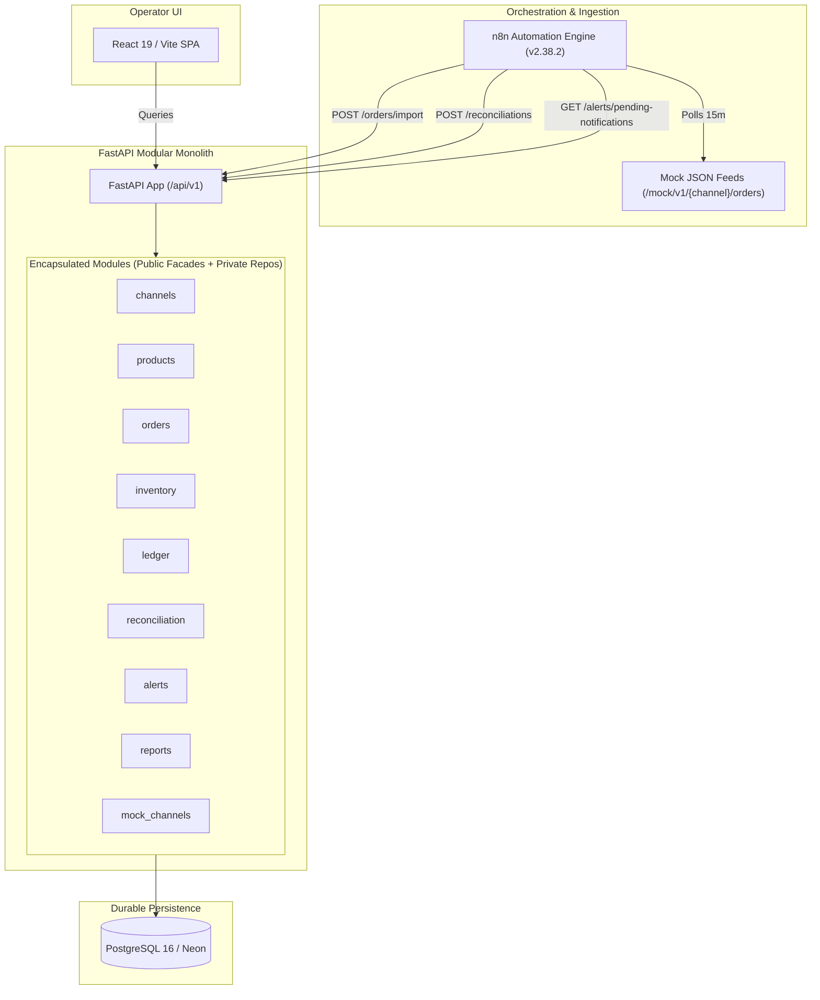

# MCO Realignment Baseline (Phase 0)

**Date:** 2026-10-02  
**Platform:** Multichannel Commerce Operations (MCO)  
**Subtitle:** Multichannel Commerce Integration, Reconciliation & Automation Platform  
**Purpose:** Record verified system baseline across architecture, database, APIs, automated workflows, and tests before starting Phase 1 implementation.

---

## 1. Verified Architecture Overview

MCO currently operates as a **hardened Modular Monolith** in FastAPI (Python 3.13) + PostgreSQL (Neon cloud/local) + n8n + React 19 / Vite.



### Architectural Strengths Preserved:
1. **Module Boundary Isolation:** Machine-enforced via AST linter (`scripts/check_module_boundaries.py`). Cross-module repository imports are strictly forbidden; modules interact solely via typed Pydantic DTOs.
2. **ACID Transaction Ingestion:** Single nested transaction boundary (`session.begin_nested()`) wrapping order creation, stock updates, ledger journaling, and alert emission.
3. **Idempotent Ingestion:** Database-level constraint on `(channel_id, external_order_id)` with `IntegrityError` race protection, returning idempotent `DUPLICATE` statuses without side effects.
4. **Structured Contextual Logging:** Context variables propagate `X-Request-ID` across all coroutines and responses.
5. **Modern Frontend:** React 19, TypeScript, Tailwind CSS, TanStack Query, Vitest.

---

## 2. Bounded Context Modules

The active codebase contains 9 modules under `backend/app/modules/`:

| Module | Core Responsibility | Public Facade (`__all__`) | Primary Models |
| :--- | :--- | :--- | :--- |
| **`channels`** | Registry of sales platforms | `Channel`, `ChannelService`, `get_channel_service` | `Channel` |
| **`products`** | Catalog master specifications and stock balance | `Product`, `ProductService`, `get_product_service` | `Product` |
| **`orders`** | Ingestion pipeline, idempotency, order queries | `Order`, `OrderService`, `OrderImportRequest`, `router` | `Order`, `OrderItem` |
| **`inventory`** | Physical stock decrements and low-stock checks | `InventoryService`, `InventoryItemRead`, `router` | None (mutates `Product`) |
| **`ledger`** | Double-entry journal for revenue and COGS | `LedgerEntry`, `LedgerService`, `OrderSaleRecord` | `LedgerEntry` |
| **`reconciliation`**| Order total & ledger audit | `ReconciliationService`, `ReconciliationRequest`, `router` | `ReconciliationLog` |
| **`alerts`** | Operational alerting, deduplication, notifications | `Alert`, `AlertService`, `LowStockAlertRequest`, `router` | `Alert` |
| **`reports`** | Cross-channel analytical read model (ADR-001) | `ReportsService`, `DailyReport`, `router` | None (SQL aggregations) |
| **`mock_channels`**| Deterministic JSON feeds for demo/dev | `MockChannelService`, `MockOrderFeed`, `router` | None (static JSON) |

---

## 3. Database Schema Baseline

PostgreSQL schema verified at Alembic revision **`0006_reconciliation (head)`**:

```mermaid
erDiagram
    channels ||--o{ orders : "receives"
    products ||--o{ order_items : "contains"
    orders ||--|{ order_items : "contains"
    orders ||--o{ ledger_entries : "journals"

    channels {
        int id PK
        varchar code UK
        varchar name
        varchar platform_type
        timestamptz created_at
    }

    products {
        int id PK
        varchar sku UK
        varchar name
        numeric cost_price
        int current_stock
        int reorder_threshold
        timestamptz created_at
        timestamptz updated_at
    }

    orders {
        int id PK
        int channel_id FK
        varchar external_order_id UK
        timestamptz order_date
        varchar status
        numeric total_amount
        timestamptz source_updated_at
        timestamptz created_at
        timestamptz updated_at
    }

    order_items {
        int id PK
        int order_id FK
        int product_id FK
        int quantity
        numeric unit_price
        numeric unit_cost
    }

    ledger_entries {
        int id PK
        int order_id FK
        varchar entry_type
        numeric amount
        timestamptz created_at
    }

    alerts {
        int id PK
        varchar type
        varchar severity
        varchar dedup_key UK_active
        text message
        boolean resolved
        timestamptz created_at
        timestamptz resolved_at
        timestamptz notified_at
    }

    reconciliation_logs {
        int id PK
        varchar source_system
        varchar status
        int records_checked
        int mismatches_found
        json detail_json
        timestamptz started_at
        timestamptz completed_at
    }
```

*Note on Database State:* The remote Neon database previously contained an orphaned, empty `stock_movements` table and an uncommitted `alembic_version` stamp (`0007_product_lifecycle`). This was identified and reconciled back to `0006_reconciliation (head)`.

---

## 4. Current API Surface

| Method | Path | Summary / Description | Auth Required |
| :--- | :--- | :--- | :--- |
| `GET` | `/health` | System health check (`{"status": "ok"}`) | None |
| `GET` | `/ready` | Database readiness check (`{"status": "ready"}`) | None |
| `GET` | `/api/v1/orders` | Paginated orders list with channel filter & search | None |
| `GET` | `/api/v1/orders/{id}` | Order detail with line items & resolved product SKUs | None |
| `POST` | `/api/v1/orders/import` | Idempotent order ingestion pipeline | None |
| `GET` | `/api/v1/inventory` | List products with current stock & `is_low_stock` flag | None |
| `GET` | `/api/v1/reports/daily` | Analytical daily revenue, COGS, gross profit totals | None |
| `POST` | `/api/v1/reconciliations`| Run order reconciliation against external payload | None |
| `GET` | `/api/v1/reconciliations`| List historical reconciliation logs | None |
| `GET` | `/api/v1/reconciliations/{id}` | Retrieve reconciliation run details | None |
| `GET` | `/api/v1/alerts` | List active or all alerts | None |
| `GET` | `/api/v1/alerts/pending-notifications` | Poll alerts pending Telegram notification | None |
| `PATCH`| `/api/v1/alerts/{id}/resolve` | Mark alert as resolved | None |
| `PATCH`| `/api/v1/alerts/{id}/notified`| Mark alert as notified by n8n | None |
| `GET` | `/mock/v1/{channel}/orders` | Mock feed returning static JSON (`shopee`, `tiktok`, `website`) | None |

---

## 5. Current n8n Automation Workflows

Workflows located in `n8n/workflows/`:

1. **`order-sync.json` (Cadence: Every 15 minutes):**
   - Triggers for channels `['shopee', 'tiktok', 'website']`.
   - Fetches from `/mock/v1/{channel}/orders`.
   - Flattens orders array.
   - Posts to `/api/v1/orders/import` (retries up to 3 times on failure).
2. **`reconciliation.json` (Cadence: Every 6 hours):**
   - Fetches snapshots from `/mock/v1/{channel}/orders`.
   - Constructs `ReconciliationRequest`.
   - Posts to `/api/v1/reconciliations`.
3. **`alert-notification.json` (Cadence: Every 5 minutes):**
   - Polls `/api/v1/alerts/pending-notifications`.
   - Sends telegram message to `TELEGRAM_CHAT_ID` via bot API.
   - Marks `/api/v1/alerts/{id}/notified`.

---

## 6. Baseline Verification Quality Gates

All baseline verification checks were executed and passed cleanly:

| Check | Tool / Command | Result | Details |
| :--- | :--- | :--- | :--- |
| **AST Module Boundaries** | `python scripts/check_module_boundaries.py` | **PASS (0 violations)** | Clean encapsulation across all 9 modules |
| **Artifact Validation** | `python scripts/validate_artifacts.py` | **PASS** | Validated 3 n8n workflows and draw.io XML |
| **Backend Lint** | `ruff check app tests` | **PASS** | 0 lint or formatting errors |
| **Backend Type Safety** | `mypy app` | **PASS** | Strict typing across 63 source files |
| **Backend Test Suite** | `pytest` | **PASS (45/45 passed in 8.46s)** | 100% pass rate across boundary, unit, and integration tests |
| **Frontend Lint** | `pnpm --filter mco-frontend lint` | **PASS** | 0 ESLint errors |
| **Frontend Tests** | `pnpm --filter mco-frontend test` | **PASS (2/2 test files)** | Vitest component & formatting tests pass |
| **Frontend Build** | `pnpm --filter mco-frontend build` | **PASS (14.28s)** | Vite production bundle generated cleanly |
| **Database Migrations** | `alembic current; alembic heads` | **PASS** | Synchronized at `0006_reconciliation (head)` |

---

## 7. Phase 1 Implementation Plan: Connector / Provider Architecture

### Goal
Decouple MCO core services from provider-specific formats by introducing an extensible **Integration / Connector Layer**. External mock feeds currently deliver pre-normalized payloads; Phase 1 introduces real heterogeneous external representations (e.g. ERP vs. Shopee vs. TikTok) and adapters that normalize them into typed Canonical DTOs without touching core business logic.

### Exact Files Affected

#### New Files to Create:
1. `backend/app/modules/integrations/__init__.py`  
   - Module public facade exporting connector interfaces, exceptions, and registry.
2. `backend/app/modules/integrations/contracts.py`  
   - Base provider interfaces: `BaseConnector`, `OrderProvider`, `InventoryProvider`, `SettlementProvider`.
   - Provider metadata, credentials configuration, and connection status schemas.
3. `backend/app/modules/integrations/errors.py`  
   - Typed integration exceptions: `IntegrationError`, `ProviderConnectionError`, `ProviderRateLimitError`, `ProviderPayloadError`.
4. `backend/app/modules/integrations/registry.py`  
   - `ConnectorRegistry` managing active connectors by channel code and platform type.
5. `backend/app/modules/integrations/providers/base.py`  
   - Common abstract connector implementation.
6. `backend/app/modules/integrations/providers/mock_erp.py`  
   - Mock ERP provider (e.g. Odoo/ERPNext format) returning distinct nested schemas (`default_code`, `qty_available`, `price_unit`).
7. `backend/app/modules/integrations/providers/mock_shopee.py`  
   - Mock Shopee Open API provider returning Shopee format (`item_sku`, `escrow_amount`, `orders_sn`, `stock`).
8. `backend/app/modules/integrations/providers/mock_tiktok.py`  
   - Mock TikTok Shop provider returning TikTok format (`order_id`, `sku_id`, `seller_cost`, `quantity_available`).
9. `backend/tests/modules/integrations/test_connector_contracts.py`  
   - Unit tests verifying provider interfaces, typing, and exception handling.
10. `backend/tests/modules/integrations/test_mock_providers.py`  
    - Unit tests validating that each provider emits heterogeneous payloads and handles simulated failures/retries.

#### Existing Files to Update:
1. `scripts/check_module_boundaries.py`  
   - Register `integrations` as an allowed module bounded context in the AST boundary checker.
2. `backend/app/api/router.py`  
   - Register integration health and connector test endpoints if needed.
3. `backend/app/modules/__init__.py`  
   - Include `integrations` in top-level modules list.

### Acceptance Criteria for Phase 1:
- [ ] Provider interfaces (`OrderProvider`, `InventoryProvider`, `SettlementProvider`) are strictly typed and decoupled from internal database models.
- [ ] Mock ERP, Shopee, and TikTok connectors expose **genuinely distinct raw external schemas**.
- [ ] Connectors handle simulated connection failures and raise typed integration exceptions (`ProviderConnectionError`, etc.).
- [ ] AST module boundary check continues to pass with 0 violations.
- [ ] Comprehensive unit tests cover all connector contracts and mock adapters.
